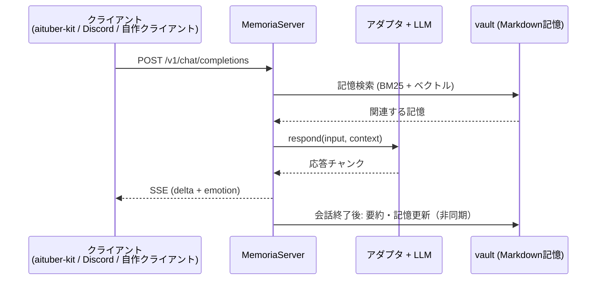

# memoria

AIキャラクターに長期記憶を持たせるRails APIサーバです。会話は人間が読める・編集できる・gitで巻き戻せるMarkdownファイル（Obsidian互換のvault）として蓄積され、キャラクターは記憶を保ったままデバイス間を移動できます（aituber-kit・Discordのクライアントで検証済み）。

クライアントからはOpenAI Chat Completions互換のAPI（`POST /api/v1/chat/completions`）として見えるため、既存のOpenAI対応クライアントをそのまま接続できます。会話するたびに記憶が整理・蓄積され、次の会話で「先週決めたこと」を踏まえた応答が返ります。

## アーキテクチャ



## 記憶の構造

会話は三層のMarkdownとしてvaultに保存されます。

| 層 | 内容 |
| --- | --- |
| FullLog (FL) | 会話の生ログ |
| SummaryNote (SN) | 会話単位の要約。重要度スコア付き |
| TagProfilingNote (TPN) | タグ（人物・トピック）ごとの理解。SNから昇格ゲートを通って更新される |

- 検索はBM25（SQLite FTS5, trigram）とベクトル検索のRRF融合。時間減衰と、Park et al. "Generative Agents" のimportanceスコアで重み付けされます
- 会話セッション終了後に「睡眠フェーズ」が非同期で走り、会話ログと既存のTPNを照合して記憶の矛盾・古い情報を検出し、検証記録（DeepReflectionノート）として残します
- vaultはローカルgitで自動バージョニングされ、ブランチ作成・スナップショット・巻き戻しをAPIから操作できます

## デバイス間プレゼンス

キャラクターは常にちょうど1つのデバイスに存在します（DB制約で担保）。`POST /transfer` で移動すると、移動元のSSEに `presence.departed`、移動先に `presence.arrived` が配信され、移動先で直前の会話の続きができます。PCのaituber-kitで会話 → 別デバイスへ転送 → 続きを話す、という流れの検証手順は [docs/AITUBER_KIT_INTEGRATION.md](docs/AITUBER_KIT_INTEGRATION.md) にあります。

## 動かして見る

同梱のデモ用vault（SummaryNote 4枚）に対して記憶検索を試せます。LLMのAPIキーは不要です（ベクトル検索が使えない場合はBM25のみで検索されます）。

```bash
GEMINI_API_KEY=dummy bin/rails runner docs/examples/demo_recall.rb
```

```
FTS indexed: 4 entries

## query: 花火大会 (1 hits)

[参照元: SN - SN-20260701120000 (2026-07-01 21:00) [1ヶ月前の会話]]
タイトル: 夏祭りの計画を立てた
ユーザーと夏祭りの計画を立てた。8月の第1土曜に隣町の花火大会へ行くことに決めた。...

## query: コーヒー (1 hits)

[参照元: SN - SN-20260710083000 (2026-07-10 17:30) [1ヶ月前の会話]]
タイトル: 朝のコーヒーの好みが変わった
朝の雑談で、ユーザーのコーヒーの好みが変わったことが分かった。以前は深煎り一択だったが、...
```

## セットアップ

```bash
bundle install
bin/rails db:setup        # デフォルトユーザーとキャラクターを作成
bin/ms-setup              # MemoriaServerの管理キー・デバイスキーを発行
bin/rails server
```

LLMは `GEMINI_API_KEY` 環境変数で設定します。キャラクター設定は環境変数（`SEED_MAIN_CHARACTER_NAME` 等）または `MEMORIA_CONFIG` で指定するYAMLから読み込まれます。プロンプトのカスタマイズは [docs/VAULT_CUSTOMIZATION.md](docs/VAULT_CUSTOMIZATION.md) を参照してください。

```bash
bundle exec rspec         # テスト
```

## 機能

- OpenAI互換API + SSEストリーミング（感情などの拡張は `x_memoria` フィールドで受け渡し。capability negotiationは [docs/ADAPTER_README.md](docs/ADAPTER_README.md)）
- 記憶検索API（`POST /api/characters/:id/memories/recall`）、記憶のブランチ・スナップショットAPI
- 自律思考ループ（会話がない間の記憶整理・考えごと）と予定（単発・繰り返し。実行できなかった予定は連絡手段に通知）
- 読書機能（青空文庫の作品を読み、内容が記憶に蓄積される）
- Discord bot、音声書き起こし・読み上げエンドポイント
- プラグイン（キャラクターにツールと指示を足す拡張。[docs/PLUGIN_README.md](docs/PLUGIN_README.md)）

## 技術スタック

Rails 8.1 (API mode) / Ruby 3.4 / SQLite (+ FTS5) / Solid Queue / MCP ([debug-mcp](https://github.com/rira100000000/debug-mcp))

## License

[MIT](LICENSE)
